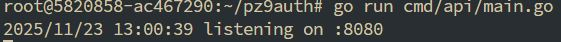
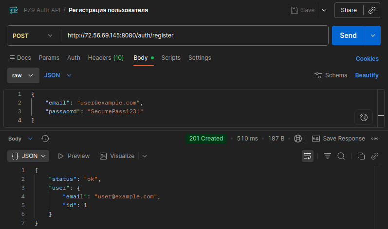
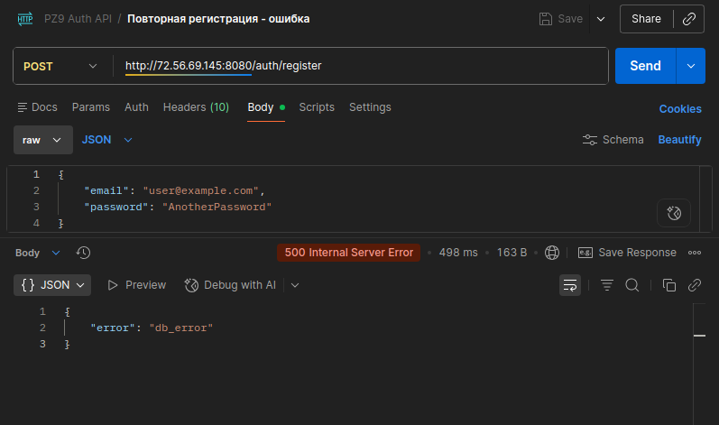
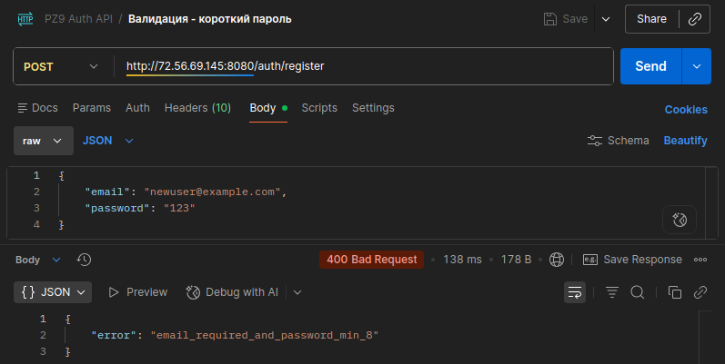
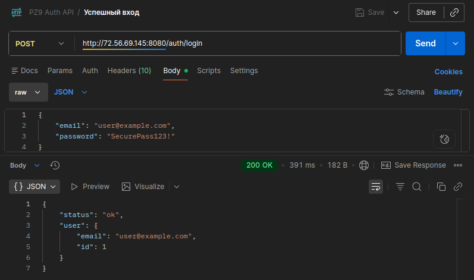
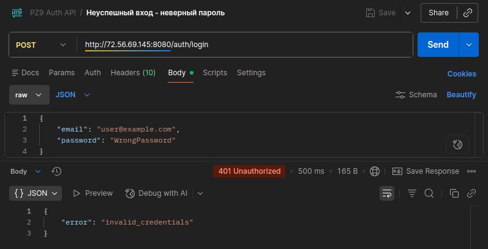
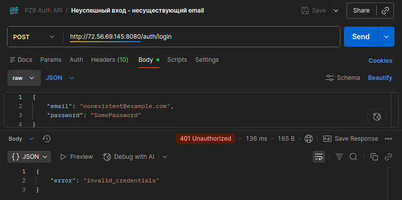

# Практическое задание № 9

# Реализация регистрации и входа пользователей. Хэширование паролец с bcrypt.

Студент группы *ЭФМО-02-25 Пягай Даниил Игоревич*

# Описание

**Цели:**

    • Научиться безопасно хранить пароли (bcrypt), валидировать вход и обрабатывать ошибки.
    • Реализовать эндпоинты POST /auth/register и POST /auth/login.
    • Закрепить работу с БД (PostgreSQL + GORM или database/sql) и валидацией ввода.
    • Подготовить основу для JWT-аутентификации в следующем ПЗ.


## Инициализация проекта

```bash
mkdir pz9auth
cd pz9auth
go mod init example.com/pz9auth
go get github.com/go-chi/chi/v5
go get gorm.io/gorm gorm.io/driver/postgres
go get golang.org/x/crypto/bcrypt
```

## Создаём структуру файлов


# Запускаем сервер и проверяем


## Регистрация пользователя


## Регистрация пользователя (повторно)


## Регистрация пользователя (короткий пароль)


## Вход (верный)


## Вход (неверный пароль)


## Вход (несуществующий пользователь)


## Список проведённых запросов

